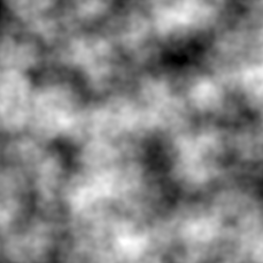

# Cartographer
A little library for generating heightmaps using a variety of algorithms.
[Documentation](./Documentation.md)

## Current Algorithms
- Perlin Noise

I'm working on adding Simplex Noise and more options to customize the kind of map you create. 

## How to use
### How to build
#### Using [xmake](https://xmake.io)
1. `git clone https://github.com/tristanisham/cartographer.git`
2. `cd` into the directory
3. `xmake` to build the neccessary directoryies
4. Then you can find a static library in:
`build/<operating system>/<architecture>/release/cartographer.lib or libcartographer.a

Then, just include:
```cpp
 #include "src/cartographer.hpp"
 ```

#### Including in your project
g++ your_main.cpp src/lodepng.cpp src/cartographer.cpp -Isrc -03

Then, just include:
```cpp
 #include "src/cartographer.hpp"
 ```